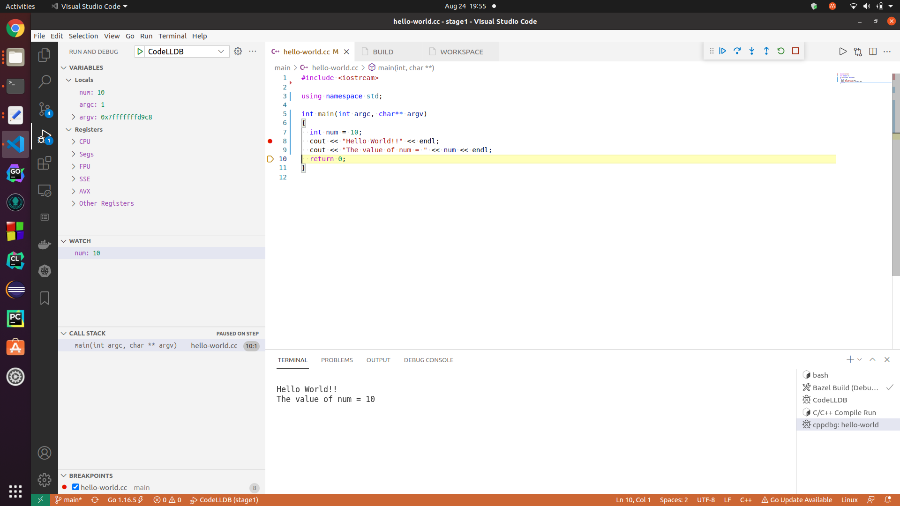

# Bazel Debug C/C++ in VS Code on Ubuntu Linux
Debug simple C/C++ Hello World program built using Bazel in Visual Studio Code on Ubuntu Linux

Reference: 
[Debugging C++ in Visual Studio Code using gcc/gdb and Bazel](https://www.youtube.com/watch?v=-TUogVOs1Qg)

Install  [Bazel](https://github.com/envoyproxy/envoy/tree/main/bazel) on Ubuntu Linux

```console
sudo wget -O /usr/local/bin/bazel https://github.com/bazelbuild/bazelisk/releases/latest/download/bazelisk-linux-amd64
sudo chmod +x /usr/local/bin/bazel
bazel version
```

* Launch Visual Studio Code
* Install [CodeLLDB](https://marketplace.visualstudio.com/items?itemName=vadimcn.vscode-lldb) extension
* Open either HelloC or HelloCpp folder
* Open main file
* Build [.vscode/tasks.json]
* Press Ctrl + Shift + B
* Set breakpoint
* Run [.vscode/launch.json]
* Press F5

Visual Studio code should break at breakpoint and you should be able to debug step through the code!

